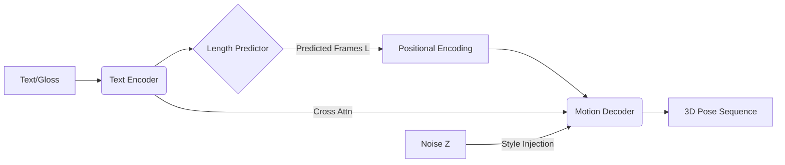

Target: High-Fidelity, Real-Time GhSL Motion Generation

Architecture: Adversarial Non-Autoregressive Transformer (GAN-NAT)

Status: 🛠 Proposal (Enhanced)

## 1. Executive Summary: The "Anti-Zombie" Approach

The v1.0 draft suffered from "Regression to the Mean," where the model minimizes MSE by outputting safe, averaged poses (the "Zombie Effect").

**Version 2.0 introduces three critical upgrades:**

1. **Adversarial Training (GAN):** A Discriminator forces the generator to produce realistic, sharp motion dynamics.
    
2. **Geometric Regularization:** Explicit losses for foot sliding and bone length consistency.
    
3. **Probabilistic Seeding:** Allows the model to generate distinct variations of signs rather than blurring them.
    

## 2. Model Architecture

### 2.1 The Generator (The Artist)

The core remains a Non-Autoregressive Transformer for speed, but with enhanced conditioning.

#### A. Text Encoder (Frozen + Adapter)

Instead of training from scratch, we leverage semantic knowledge.

- **Base:** DistilBERT (or your existing Sign2Text Encoder if aligned).
    
- **Adapter:** A small MLP to project text embeddings into the motion latent space.
    
- _Why:_ "Hello" and "Hi" are semantically close; a pre-trained LLM knows this. A scratch encoder does not.
    

#### B. Length Estimator (Gaussian Smeared)

- **Input:** Text Context Vector.
    
- **Output:** Scalar $L$ (number of frames).
    
- **Improvement:** During training, we don't just predict $L$. We predict a classification distribution over possible lengths (Softmax) to handle ambiguity better than pure regression.
    

#### C. Motion Decoder (Style-Aware)

- **Input:** Queries of length $L$ + Positional Encodings.
    
- **Style Injection:** Concatenate a random noise vector $z \sim \mathcal{N}(0, I)$ to the input queries. This allows the model to generate "Happy Hello" vs "Lazy Hello" based on the noise seed.
    

### 2.2 The Discriminator (The Critic)

_This is the most important addition for preventing the Zombie Effect._

A separate **Motion Discriminator** ($D$) looks at short clips (e.g., 20 frames) and decides: **"Is this Real GhSL or Fake AI?"**

- **Architecture:** 1D Temporal Convolutional Network (TCN).
    
- **Input:** $(B, T, \text{Joints} \times 3)$.
    
- **Output:** Probability scalar $[0, 1]$.
    

## 3. The "Robust" Loss Function

$$ \mathcal{L}_{total} = \lambda_{rec}\mathcal{L}_{Recon} + \lambda_{adv}\mathcal{L}_{GAN} + \lambda_{geo}\mathcal{L}_{Geo} $$

### A. Reconstruction Loss ($\mathcal{L}_{Recon}$)

Standard MSE is not enough. We use **Huber Loss** (less sensitive to outliers) on both:

1. **Positions:** Where are the joints?
    
2. **Velocities:** How fast are they moving? (First derivative)
    
3. **Accelerations:** How is the speed changing? (Second derivative - critical for "snappy" sign language).
    

### B. Adversarial Loss ($\mathcal{L}_{GAN}$)

Standard GAN hinge loss.

- Generator tries to fool Discriminator.
    
- Discriminator tries to catch Generator.
    
- _Result:_ The Generator learns to add "high-frequency" details (micro-movements) that look real, even if they aren't perfectly aligned with the ground truth.
    

### C. Geometric Loss ($\mathcal{L}_{Geo}$)

1. Bone Consistency:
    
    $$ \mathcal{L}{bone} = \left| ||J{elbow} - J_{shoulder}|| - L_{arm} \right| $$
    
    Penalizes the arm stretching or shrinking.
    
2. **Foot Contact (Anti-Sliding) Loss:**
    
    - If the foot height ($y$) is near 0 (ground), the foot velocity ($v$) MUST be 0.
        
    - $$ \mathcal{L}_{contact} = \text{ReLU}(-y + \epsilon) \cdot ||v_{foot}||^2 $$
        
    - _Effect:_ Prevents the avatar from "ice skating" while standing still.
        

## 4. Training Strategy

### 4.1 Curriculum Learning

You cannot turn on all losses at once. The model will explode.

1. **Warmup (Epoch 0-10):** Train only with $\mathcal{L}_{Recon}$ (MSE). Let it learn the "Zombie" mean poses first.
    
2. **Geometric Phase (Epoch 11-20):** Enable $\mathcal{L}_{Geo}$. Force the bones to be rigid.
    
3. **Adversarial Phase (Epoch 20+):** Turn on the Discriminator. This is where the magic happens. The motion will start looking sharp.
    

### 4.2 Data Handling

- **Input:** Gloss is preferred over raw English.
    
    - _English:_ "I am going to the store"
        
    - _Gloss:_ `[ME] [GO] [STORE]`
        
- **Normalization:**
    
    - **Root Centering:** All poses must be relative to the Hip Center (0,0,0).
        
    - **Forward Facing:** Rotate all training data so the user faces $Z+$.
        
    - **Scale:** Normalize standard deviation of motion to $\approx 1$.
        

## 5. Inference Pipeline (Production)

1. **Text Pre-processing:** User Text $\rightarrow$ LLM (English-to-Gloss) $\rightarrow$ Gloss Tokens.
    
2. **Inference:**
    
    - Encoder predicts Latents.
        
    - Length Predictor predicts $N$ frames.
        
    - Decoder generates $N$ poses.
        
3. **1€ Filter (One Euro Filter):**
    
    - Apply this specific filter for jitter removal. It dynamically adjusts smoothing based on speed (smooths slow motion, preserves fast motion).
        
4. **IK Solver:**
    
    - Retarget generic points to Avatar Bones (See Rigging Spec).
        

## 6. Prompt for Agent (Implementation)

> **Task:** Implement `ghsl_gan_trainer.py`.
> 
> **Components:**
> 
> 1. `Generator`: Transformer Encoder-Decoder with a `style_noise` input channel.
>     
> 2. `Discriminator`: A 3-layer 1D-CNN that classifies motion sequences $(B, C, T)$ as Real/Fake.
>     
> 3. `Losses`:
>     
>     - Implement `GeodesicLoss` for bone lengths.
>         
>     - Implement `FootSlidingLoss` (penalize velocity when $y < 0.02$).
>         
>     - Implement `AdversarialLoss` (Hinge).
>         
> 
> **Training Loop:**
> 
> - Use two optimizers: `opt_g` (Generator) and `opt_d` (Discriminator).
>     
> - Train Discriminator every step.
>     
> - Train Generator every step.
>     
> - **Crucial:** Apply `SpectralNorm` to the Discriminator layers to stabilize training.
>